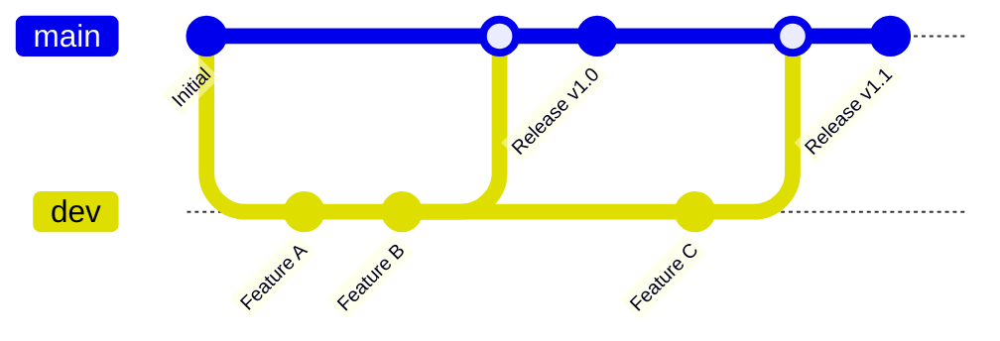

# 📚 Guide Complet - Workflow de Développement CI/CD

## 📋 Table des matières

1. [Vue d'ensemble](#vue-densemble)
2. [Architecture des branches](#architecture-des-branches)
3. [Workflows GitHub Actions](#workflows-github-actions)
4. [Configuration GitHub](#configuration-github)
5. [Flux de travail quotidien](#flux-de-travail-quotidien)
6. [Commandes et scripts](#commandes-et-scripts)
7. [Dépannage](#dépannage)
8. [Bonnes pratiques](#bonnes-pratiques)

---

## 🎯 Vue d'ensemble

Ce projet utilise un workflow de développement professionnel avec validation automatique et déploiement continu :

### **Branches principales :**
- **`dev`** : Branche de développement et tests
- **`main`** : Branche de production stable et déployable

### **Principe :**
1. **Développement** → Push sur `dev` → Tests automatiques
2. **Validation** → Pull Request `dev` → `main` → Tests complets
3. **Production** → Merge vers `main` → Déploiement automatique

---

## 🌳 Architecture des branches



### **Protection des branches :**

| Branche | Protection | Tests requis | Déploiement |
|---------|------------|--------------|-------------|
| `dev` | ❌ Libre | ✅ Automatiques | ❌ Aucun |
| `main` | ✅ PR obligatoire | ✅ Complets | ✅ Production |

---

## ⚙️ Workflows GitHub Actions

### **1. Workflow principal : `ci.yml`**

```yaml
# Déclencheurs
on:
  push:
    branches: [ main, develop, dev ]
  pull_request:
    branches: [ main, develop, dev ]
```

**Jobs exécutés :**

#### **Job `test` :**
- 🧪 Tests unitaires et d'intégration
- 🔍 Linting TypeScript
- 📊 Couverture de code
- 🏗️ Build de vérification

#### **Job `security` :**
- 🛡️ npm audit (niveau modéré)
- 🚨 Vérification vulnérabilités critiques
- 📋 Rapport de sécurité

#### **Job `docker` :**
- 🐳 Build de l'image Docker
- ✅ Validation Dockerfile.prod
- 💾 Cache des layers Docker

#### **Job `deploy` (main uniquement) :**
- 🚀 Déploiement en production
- 📢 Notifications de déploiement

### **2. Workflow PR : `pr-checks.yml`**

```yaml
# Déclencheurs
on:
  pull_request:
    branches: [ main ]
    types: [opened, synchronize, reopened]
```

**Jobs spécialisés :**

#### **Job `validate-pr` :**
- 🔍 Validation structure PR
- 📋 Vérification source = `dev`

#### **Job `pr-tests` :**
- 🧪 Suite complète de tests
- 🛡️ Audit de sécurité renforcé
- 🐳 Validation build Docker
- 📊 Rapport détaillé de la PR

### **3. Workflow Docker Hub : `docker-hub.yml`** ⚠️ **SUPPRIMÉ**

~~```yaml
# Publication d'images Docker (optionnel)
# Requiert DOCKER_USERNAME et DOCKER_PASSWORD
```~~

**Note :** Ce workflow a été supprimé car non utilisé actuellement. Pour réactiver la publication Docker Hub, consultez la section "Prochaines étapes".

---

## 🔧 Configuration GitHub

### **1. Protection de la branche `main`**

Allez dans **Settings** → **Branches** → **Add rule** :

```yaml
Branch name pattern: main

Protection rules:
✅ Require a pull request before merging
  ✅ Require approvals: 1
  ✅ Dismiss stale PR approvals when new commits are pushed
  ✅ Require review from code owners

✅ Require status checks to pass before merging
  ✅ Require branches to be up to date before merging

  Required status checks:
  - pr-tests
  - validate-pr
  - security

✅ Require conversation resolution before merging
✅ Include administrators
🚫 Allow force pushes: Never
🚫 Allow deletions: Never
```

### **2. Secrets GitHub (optionnels)**

Dans **Settings** → **Secrets and variables** → **Actions** :

```bash
# Pour Docker Hub (optionnel)
DOCKER_USERNAME=your-dockerhub-username
DOCKER_PASSWORD=your-dockerhub-password-or-token

# Pour déploiement (futur)
PRODUCTION_SSH_KEY=your-ssh-private-key
PRODUCTION_HOST=your-server-ip
```

### **3. Variables d'environnement**

```bash
# Variables publiques
ENVIRONMENT_NAME=production
NODE_VERSION=20.x
```

---

## 🔄 Flux de travail quotidien

### **Étape 1 : Développement sur `dev`**

```bash
# 1. Basculer sur dev et mettre à jour
git checkout dev
git pull origin dev

# 2. Créer une nouvelle fonctionnalité
git checkout -b feature/nouvelle-fonctionnalite
# ... développement ...

# 3. Tester localement
cd backend
npm run lint
npm run test
npm run build

# 4. Commiter et pousser
git add .
git commit -m "feat: ajouter nouvelle fonctionnalité"
git push origin feature/nouvelle-fonctionnalite

# 5. Créer PR vers dev
gh pr create --base dev --head feature/nouvelle-fonctionnalite

# 6. Après merge, mettre à jour dev
git checkout dev
git pull origin dev
git push origin dev  # → Déclenche les tests automatiques
```

**Ce qui se passe automatiquement sur `dev` :**
- ✅ Job `test` : Tests complets (Node 18.x et 20.x)
- ✅ Job `security` : Audit de sécurité
- ✅ Job `docker` : Build Docker de validation
- 📊 Rapports dans l'onglet Actions

### **Étape 2 : Promotion vers production**

```bash
# 1. Vérifier que dev fonctionne
git checkout dev
git status
# Vérifier que tous les tests passent sur GitHub

# 2. Créer PR vers main
gh pr create \
  --base main \
  --head dev \
  --title "Release: Deploy version $(date +%Y.%m.%d)" \
  --body "## 🚀 Release Notes

### ✨ Nouvelles fonctionnalités
- Fonctionnalité A
- Fonctionnalité B

### 🐛 Corrections
- Correction bug X
- Amélioration performance Y

### 🔒 Sécurité
- Mise à jour dépendances
- Audit de sécurité validé

### ✅ Tests
- Tous les tests passent
- Couverture de code maintenue
- Build Docker validé"
```

**Ce qui se passe automatiquement sur la PR :**
- 🔍 Job `validate-pr` : Validation structure
- 🧪 Job `pr-tests` : Tests complets avec services
- 🛡️ Audit de sécurité renforcé
- 🐳 Build Docker de production
- 📊 Rapport détaillé affiché dans la PR

### **Étape 3 : Déploiement production**

```bash
# Après validation et merge automatique
git checkout main
git pull origin main
```

**Ce qui se passe automatiquement :**
- 🚀 Job `deploy` : Déploiement en production
- 📦 Image Docker construite et taguée
- 🔔 Notifications de succès
- 📝 Log de déploiement

---

## 💻 Commandes et scripts

### **Scripts npm disponibles :**

```bash
# Tests
npm run test              # Tous les tests
npm run test:unit         # Tests unitaires seulement
npm run test:integration  # Tests d'intégration seulement
npm run test:coverage     # Tests avec couverture
npm run test:watch        # Tests en mode watch

# Qualité de code
npm run lint              # Vérification TypeScript
npm run lint:check        # Vérification sans correction
npm run format            # Formatage Prettier

# Build
npm run build             # Compilation TypeScript
npm run dev               # Développement avec hot-reload
npm run start             # Démarrage production

# Base de données
npm run seed              # Données de test
npm run seed:test         # Données pour tests
```

### **Commandes Docker :**

```bash
# Développement local
docker-compose up -d                    # Démarrage dev
docker-compose down                     # Arrêt
docker-compose logs backend            # Logs backend

# Production locale
docker-compose -f docker-compose.prod.yml up -d    # Démarrage prod
docker-compose -f docker-compose.prod.yml down     # Arrêt prod

# Build manuel
docker build -f backend/Dockerfile.prod backend/   # Build image
docker run -p 5000:5000 cuisine-backend:latest     # Test image
```

### **Commandes Git utiles :**

```bash
# Synchronisation
git checkout dev && git pull origin main && git push origin dev

# Nettoyage branches
git branch -d feature/ancienne-branche          # Supprimer locale
git push origin --delete feature/ancienne-branche  # Supprimer distante

# Historique
git log --oneline --graph --all                # Graphique des commits
git log --grep="feat"                          # Rechercher commits

# État des workflows
gh run list                                     # Liste des exécutions
gh run view <run-id>                           # Détails d'une exécution
```

---

## 🐛 Dépannage

### **Problème : Tests échouent sur `dev`**

```bash
# 1. Reproduire localement
cd backend
npm ci
npm run test

# 2. Vérifier les logs GitHub
gh run list --branch dev
gh run view <run-id>

# 3. Corrections communes
npm run lint --fix          # Corriger linting
npm audit fix               # Corriger vulnérabilités
npm run test -- --verbose   # Tests détaillés

# 4. Pousser les corrections
git add .
git commit -m "fix: correction tests"
git push origin dev
```

### **Problème : PR `dev` → `main` bloquée**

```bash
# 1. Vérifier status checks
gh pr status

# 2. Voir les détails des échecs
gh pr checks

# 3. Corriger sur dev
git checkout dev
# ... corrections ...
git push origin dev  # PR se met à jour automatiquement

# 4. Re-déclencher les checks si nécessaire
gh pr ready  # Marquer comme prête
```

### **Problème : Build Docker échoue**

```bash
# 1. Tester localement
cd backend
docker build -f Dockerfile.prod .

# 2. Vérifier les dépendances
npm run build  # Doit fonctionner avant Docker

# 3. Problèmes courants
# - tsconfig.json manquant
# - Dépendances TypeScript manquantes
# - Erreurs de compilation

# 4. Debug Docker
docker build -f Dockerfile.prod . --progress=plain
```

### **Problème : Audit de sécurité échoue**

```bash
# 1. Vérifier localement
npm audit --audit-level high

# 2. Corriger automatiquement
npm audit fix

# 3. Correction manuelle
npm audit fix --force

# 4. Mise à jour des dépendances
npm update
npm outdated  # Vérifier versions disponibles
```

### **Erreurs courantes et solutions :**

| Erreur | Cause | Solution |
|--------|-------|----------|
| `npm ci failed` | package-lock.json corrompu | `rm package-lock.json && npm install` |
| `TypeScript errors` | Types manquants | Vérifier `@types/*` dans devDependencies |
| `Docker build failed` | Dépendances manquantes | Vérifier Dockerfile.prod |
| `Tests timeout` | Services non démarrés | Vérifier MongoDB/Redis dans workflow |
| `Audit high vulnerabilities` | Dépendances vulnérables | `npm audit fix` ou mise à jour |

---

## ✅ Bonnes pratiques

### **Convention de commits :**

```bash
# Format
type(scope): description

# Types
feat:     # Nouvelle fonctionnalité
fix:      # Correction de bug
docs:     # Documentation
style:    # Formatage, pas de changement de code
refactor: # Refactoring sans nouvelle fonctionnalité
test:     # Ajout ou modification de tests
chore:    # Maintenance (deps, config, etc.)

# Exemples
feat(auth): ajouter authentification JWT
fix(api): corriger validation email
docs(readme): mettre à jour installation
test(user): ajouter tests API utilisateur
```

### **Messages de PR :**

```markdown
## 📝 Description
Description claire des changements

## ✨ Changements
- [ ] Nouvelle fonctionnalité A
- [ ] Correction bug B
- [ ] Amélioration performance C

## 🧪 Tests
- [ ] Tests unitaires ajoutés/mis à jour
- [ ] Tests d'intégration validés
- [ ] Tests manuels effectués

## 📋 Checklist
- [ ] Code reviewé
- [ ] Documentation mise à jour
- [ ] Pas de vulnérabilités de sécurité
- [ ] Build Docker fonctionnel
```

### **Règles de développement :**

1. **🚫 Jamais de push direct sur `main`**
2. **✅ Toujours tester sur `dev` d'abord**
3. **🔒 Une seule PR `dev` → `main` à la fois**
4. **📝 Messages de commit descriptifs**
5. **🧪 Tests avant chaque commit**
6. **🔄 Synchroniser `dev` avec `main` régulièrement**

### **Optimisations performances :**

```bash
# Cache GitHub Actions
- uses: actions/setup-node@v4
  with:
    cache: 'npm'
    cache-dependency-path: backend/package-lock.json

# Cache Docker layers
cache-from: type=gha
cache-to: type=gha,mode=max

# Tests parallèles
strategy:
  matrix:
    node-version: [18.x, 20.x]
```

---

## 🚀 Prochaines étapes

### **Améliorations possibles :**

1. **Monitoring avancé**
   - Intégration Sentry pour erreurs
   - Métriques de performance
   - Alertes automatiques

2. **Déploiement automatisé**
   - Configuration serveur de production
   - Scripts de déploiement
   - Rollback automatique

3. **Tests avancés**
   - Tests end-to-end Cypress
   - Tests de performance
   - Tests de sécurité automatisés

4. **Qualité de code**
   - SonarQube integration
   - Métriques de complexité
   - Analyse de dépendances

### **Configuration initiale à faire :**

```bash
# 1. Créer la branche dev
git checkout -b dev
git push origin dev

# 2. Configurer protection main sur GitHub
# Settings → Branches → Add rule

# 3. Tester le workflow
git checkout dev
echo "test" >> README.md
git add . && git commit -m "test: workflow validation"
git push origin dev

# 4. Créer première PR
gh pr create --base main --head dev --title "chore: setup CI/CD workflow"
```

---

## 📞 Support

En cas de problème avec ce workflow :

1. **📖 Consultez ce guide**
2. **🔍 Vérifiez les logs GitHub Actions**
3. **🧪 Testez localement d'abord**
4. **💬 Créez une issue avec détails**

---

*Guide mis à jour le : $(date +'%d/%m/%Y')*
*Version : 1.0*
